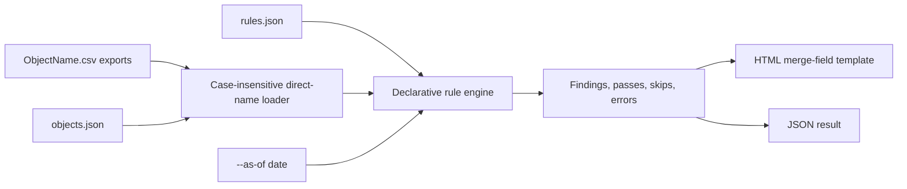
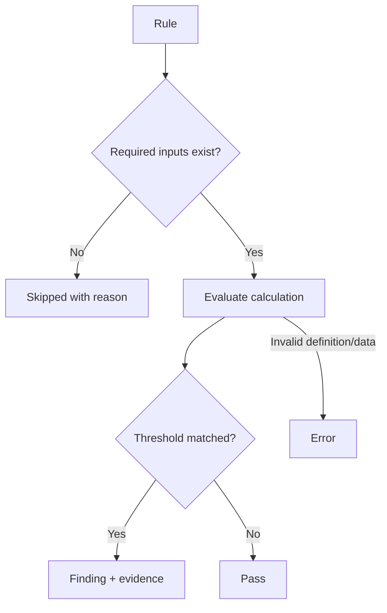

# Tribal KB

`tribal-kb` is a dependency-free Python CLI that turns Salesforce CSV exports
into a deterministic tribal-knowledge report. It finds factual patterns in
naming, ownership, cross-object relationships, unofficial workarounds,
pipeline, support language, and activity.

Every result includes its exact calculation, threshold, status, and optional
row evidence. Rules are declarative JSON and never execute arbitrary code.

## What Is Included

- 40 runnable Salesforce-specific rules imported from the idea catalog
- Explicit thresholds in place of subjective terms such as "high" or "outlier"
- Case-insensitive direct `<ObjectName>.csv` discovery
- Same-object and cross-object relationship analysis
- Root-aware comparisons such as `Opportunity.OwnerId != Account.OwnerId`
- Normalized duplicate detection for email, text, and company names
- Count, sum, average, distinct, concentration, weighted concentration, and duplicate aggregates
- Reproducible relative-date rules through `--as-of YYYY-MM-DD`
- Five self-contained HTML report templates plus custom merge-field templates
- Optional machine-readable JSON output
- A 50-row, seven-object sample export that produces a complete report

## Quick Start

Requires Python 3.10 or newer.

```bash
python -m venv .venv
source .venv/bin/activate
python -m pip install -e .

tribal-kb validate \
  --data-dir examples/data \
  --objects examples/objects.json \
  --rules examples/rules.json \
  --as-of 2026-06-13

tribal-kb analyze \
  --data-dir examples/data \
  --objects examples/objects.json \
  --rules examples/rules.json \
  --as-of 2026-06-13 \
  --template executive \
  --output reports/complete-run.html \
  --json-output reports/complete-run.json
```

Without installation, prepend commands with `PYTHONPATH=src python -m tribal_kb`.

## CSV Naming Contract

Each configured Salesforce object must have one direct filename:

```text
<ObjectName>.csv
```

Matching is case-insensitive, so all of these satisfy object `Account`:

```text
Account.csv
account.csv
ACCOUNT.CSV
```

Plural or renamed files such as `accounts.csv` do not match `Account`. The
object config can omit `file` because the filename is derived from the object
name:

```json
{
  "objects": {
    "Account": { "primary_key": "Id" },
    "Contact": { "primary_key": "Id" },
    "Opportunity": { "primary_key": "Id" }
  }
}
```

## Processing Flow





## Report Templates

List built-ins:

```bash
tribal-kb templates
```

| Template | Style |
|---|---|
| `executive` | Editorial executive report |
| `midnight` | Dark technical signal console |
| `blueprint` | System blueprint and schedule |
| `field-notes` | Research notebook |
| `signal-board` | Dense visual signal dashboard |

Use a built-in name or a custom HTML path:

```bash
tribal-kb analyze ... --template midnight
tribal-kb analyze ... --template path/to/custom-report.html
```

Custom templates use strict merge fields. Unknown fields fail the run instead
of silently generating an incomplete report.

| Merge field | Value |
|---|---|
| `{{report_title}}`, `{{report_subtitle}}` | Report metadata |
| `{{as_of}}`, `{{generated_at}}`, `{{template_name}}` | Analysis and generation metadata |
| `{{record_count}}`, `{{source_count}}`, `{{rule_count}}` | Coverage totals |
| `{{finding_count}}`, `{{pass_count}}`, `{{skipped_count}}`, `{{error_count}}` | Status totals |
| `{{summary_text}}` | Generated run summary |
| `{{category_rows}}` | Category summary table rows |
| `{{rule_cards}}` | Finding, pass, skip, and error details |
| `{{source_chips}}` | Object and row-count labels |

## Imported Rule Library

The source analysis contained 315 candidate ideas. The shipped library imports
the deterministic, runnable families that can be proven from the available CSV
values. Ideas requiring unavailable history/metadata exports or undefined
judgment words were not represented as facts. One supplied file contained no
rule catalog and was not imported.

| Rule ID | Category | Deterministic observation |
|---|---|---|
| `contact-email-coverage` | Contact knowledge | Contacts without email addresses |
| `duplicate-contact-email` | Contact knowledge | Contacts share normalized email addresses |
| `personal-contact-email` | Contact knowledge | Business contacts use personal email domains |
| `normalized-account-name-duplicates` | Naming and nomenclature | Account names collapse to the same company name |
| `account-alias-markers` | Naming and nomenclature | Account names contain alias-style markers |
| `bucket-account-names` | Naming and nomenclature | Account names contain explicit bucket terms |
| `contact-owner-account-owner-mismatch` | Ownership and hidden contributors | Accounts have contacts owned by other users |
| `accounts-without-contacts` | Cross-object relationships | Accounts exist without mapped contacts |
| `accounts-with-contacts-no-opportunities` | Cross-object relationships | Accounts have contacts but no opportunities |
| `accounts-with-opportunities-no-contacts` | Cross-object relationships | Accounts have opportunities but no contacts |
| `account-opportunity-owner-mismatch` | Ownership and hidden contributors | Account owners differ from related opportunity owners |
| `shadow-account-contributors` | Ownership and hidden contributors | Non-owners log activity on accounts |
| `unofficial-account-teams` | Workarounds and unofficial mechanisms | Accounts use activity contributors without Account Team rows |
| `inactive-account-owners` | Ownership and hidden contributors | Accounts are owned by inactive users |
| `integration-created-accounts` | Ownership and hidden contributors | Core accounts were created by an integration user |
| `stale-open-pipeline` | Pipeline knowledge | Open pipeline contains stale close dates |
| `missing-next-step` | Pipeline knowledge | Open opportunities lack documented next steps |
| `open-pipeline-owner-concentration` | Pipeline knowledge | Open opportunity ownership is concentrated |
| `won-revenue-owner-concentration` | Ownership and hidden contributors | Won revenue is concentrated under one owner |
| `renewal-classification-in-name` | Workarounds and unofficial mechanisms | Opportunity names carry renewal classification |
| `opportunity-code-names` | Naming and nomenclature | Opportunity names contain internal code patterns |
| `open-opportunities-without-task-activity` | Activity knowledge | Open opportunities have no directly linked tasks |
| `accounts-with-repeat-wins` | Cross-object relationships | Accounts have repeat won opportunities |
| `repeated-case-subjects` | Support and internal language | Case subjects repeat after text normalization |
| `account-repeat-case-issues` | Support and internal language | Accounts repeat the same normalized case subject |
| `case-workaround-language` | Support and internal language | Cases explicitly mention workaround language |
| `case-urgency-language` | Support and internal language | Cases contain explicit urgency language |
| `case-external-tool-references` | Support and internal language | Cases reference external tools |
| `case-manual-process-language` | Workarounds and unofficial mechanisms | Cases describe manual process steps |
| `low-priority-urgent-cases` | Support and internal language | Low-priority cases contain urgency language |
| `case-internal-code-patterns` | Naming and nomenclature | Case subjects contain internal code patterns |
| `case-origin-concentration` | Support and internal language | Case origin is concentrated in one channel |
| `unlinked-task-activity` | Activity knowledge | Tasks are not linked to a WhoId or WhatId |
| `task-shorthand-codes` | Naming and nomenclature | Task subjects contain shorthand code patterns |
| `task-owner-concentration` | Activity knowledge | Logged task activity is concentrated under one owner |
| `support-heavy-low-pipeline-accounts` | Cross-object relationships | Accounts have high support volume and limited opportunity amount |
| `revenue-heavy-support-light-accounts` | Cross-object relationships | Accounts have substantial won revenue and limited case volume |
| `accounts-with-cases-no-contacts` | Cross-object relationships | Accounts have cases but no contacts |
| `sales-active-support-invisible-accounts` | Cross-object relationships | Accounts have open opportunities and no cases |
| `generic-account-type-values` | Naming and nomenclature | Account Type uses generic values |

The library is [examples/rules.json](examples/rules.json). Full authoring syntax
is in [docs/rules-reference.md](docs/rules-reference.md).

## Deterministic Guarantees

`tribal-kb` treats a result as deterministic only when:

1. Input CSV bytes, object config, rules JSON, and `--as-of` date are fixed.
2. Every threshold and vocabulary list is explicitly declared.
3. No LLM, arbitrary Python, network request, fuzzy model, or hidden state is used.
4. Division by zero returns zero.
5. Missing declared optional inputs can produce `skipped`; invalid logic produces `error`.

The same inputs and `--as-of` date produce the same rule values and statuses.
Only report generation timestamp metadata changes between runs.

## Project Structure

```text
src/tribal_kb/            CLI, loader, rules engine, and report renderer
src/tribal_kb/templates/  Five built-in merge-field HTML templates
examples/data/            Seven-object made-up Salesforce export
examples/objects.json     Direct object-to-CSV contract
examples/rules.json       40-rule imported library
docs/                     Rule authoring reference
tests/                    Standard-library unittest suite
reports/                  Generated reports, ignored by git
```

## Tests

```bash
PYTHONPATH=src python -m unittest discover -v
```

The suite verifies direct case-insensitive CSV naming, normalized duplicates,
root-aware relationships, weighted concentration, explicit as-of dates,
rule-pack execution, JSON output, and all five HTML templates.
